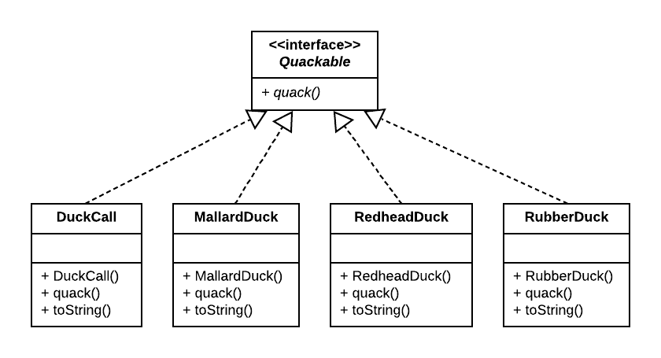
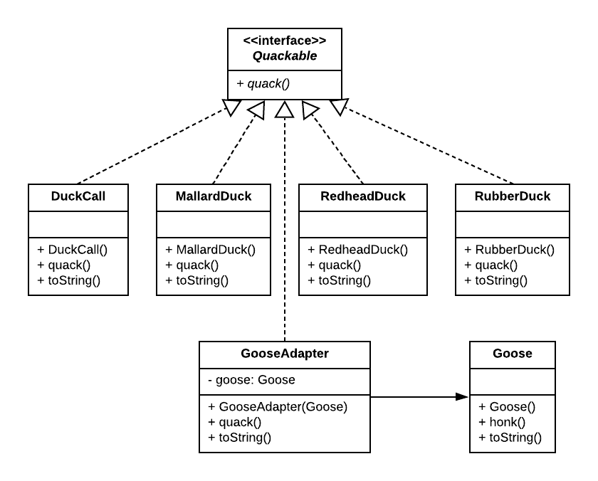
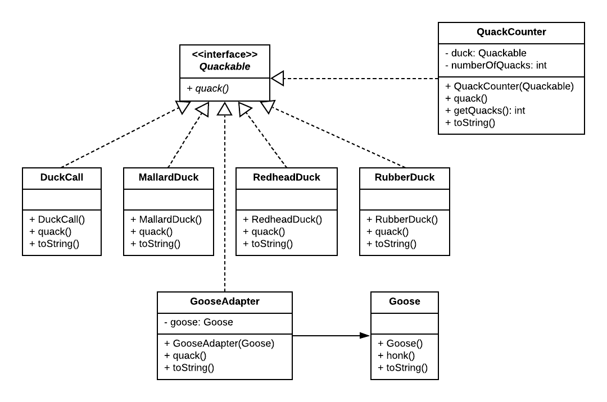
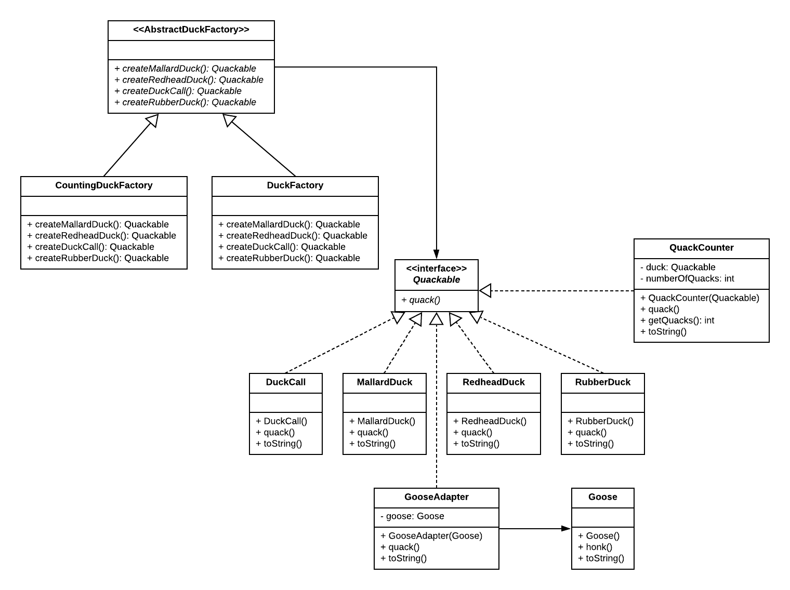
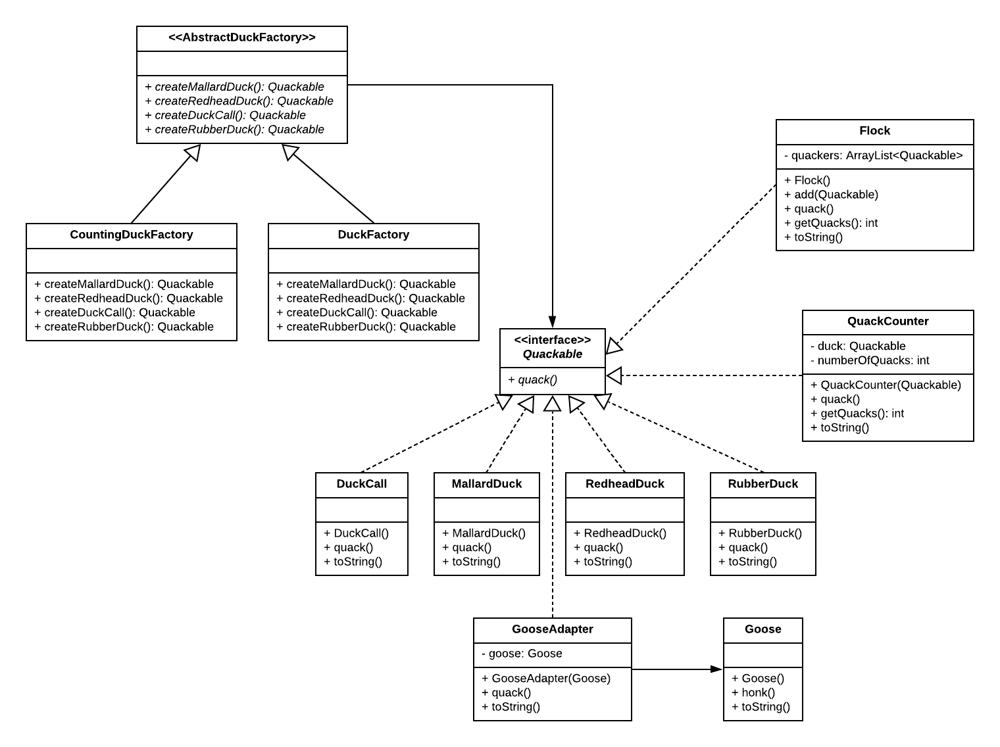
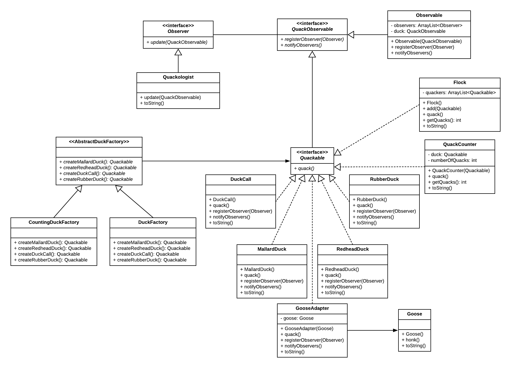

The Compound pattern is the practice of utilizing multiple patterns.

Below is the example showing how patterns __Strategy__, __Adapter__, __Decorator__, __Factory__, __Composite__, and __Observer__ are working together:

Strategy:

Adapter:

Decorator:

Factory:

Composite:

Observer:

