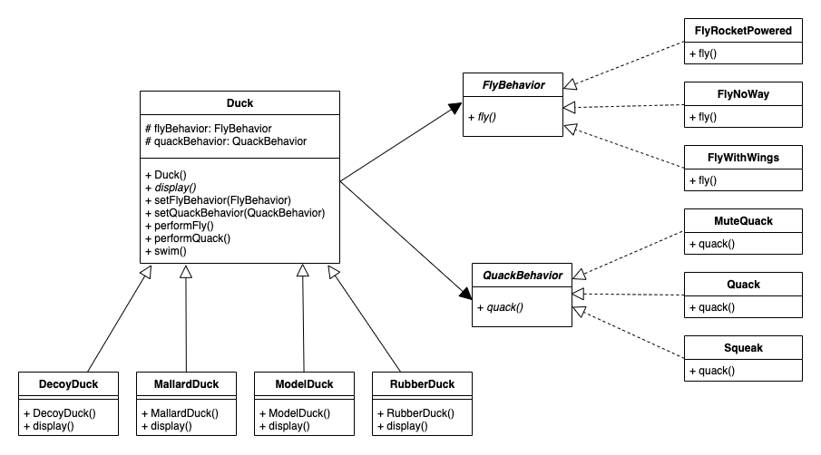
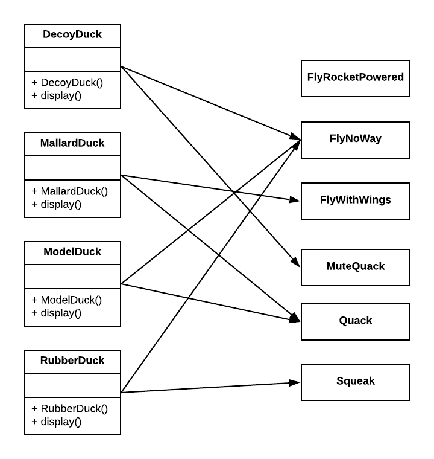
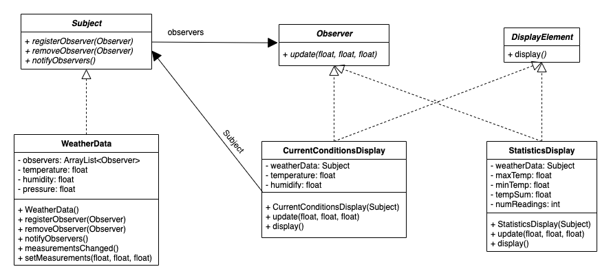
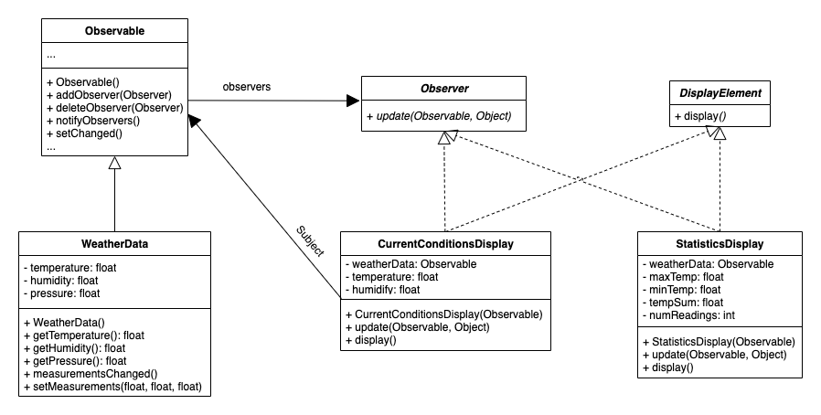
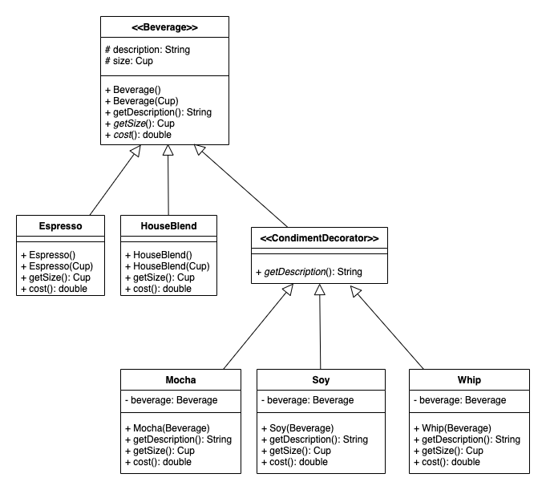

- [Design Principle](#design-principle)
- [Patterns](#patterns)
    - [Strategy](#strategy)
    - [Observer](#observer)
        - [Push Mode](#push-mode)
        - [Pull Mode](#pull-mode)
    - [Decorator](#decorator)
- [Reference](#reference)

This repository is used to have a quick overview on those design patterns introduced from the book __Head First Design Patterns__.

# Design Principle

- Favor composition over inheritance.
- Strive for loosely coupled designs between objects that interact.
- Identify the aspects of your application that vary and separate them from what stays the same.
- Program to an interface, not an implementation.
- Classes should be open for extension, but closed for modification.

# Patterns

## Strategy

The __Strategy__ Pattern defines a family of algorithms, encapsulates each one, and makes them interchangeable. Strategy lets the algorithm vary independently from clients that use it.

Example Diagram:

How Strategy is actually applied:

## Observer

The __Observer__ Pattern defines a one-to-many dependency between objects so that when one object changes state, all of its dependents are notified and updated automatically.

For simplicity, the connection between `Subject` & `StatisticsDiplay` in _Push_ mode, and connection between `Observable` & `StatisticsDiplay` in _Pull_ mode is not drawn.

### Push Mode

In __Push__ mode, it's `WeatherData` to automatically __push__ notifications to all observers. Whenever there is a change, `WeatherData` would call each observer's `update()` method with its attributes to notify.

### Pull Mode

Like the __Push__ mode, `WeatherData` would notify all observers when there is a change under __Pull__ mode. However, unlike data is forcely pushed to observers under __Push__ mode, it's the observer's choice to decide whether to "pull" data from the `Observable` since the `update()` method in __Pull__ mode pass the `Observable` in. That's the key difference between __Pull__ and __Push__.

Note that the code implemented in __Pull__ mode uses existing `Observer` and `Observable` from `java.util` library.

## Decorator

 The __Decorator__ Pattern attaches additional responsibilities to an object dynamically. Decorators provide a flexible alternative to subclassing for extending functionality.

# Reference
- Online book: https://www.oreilly.com/library/view/head-first-design/0596007124/
- Official source codes: https://wickedlysmart.com/headfirstdesignpatterns/
- Book pdf: http://ce.sharif.edu/courses/98-99/2/ce484-1/resources/root/Design%20Patterns/Eric%20Freeman,%20Elisabeth%20Freeman,%20Kathy%20Sierra,%20Bert%20Bates-Head%20First%20Design%20Patterns%20-OReilly%20(2008).pdf
