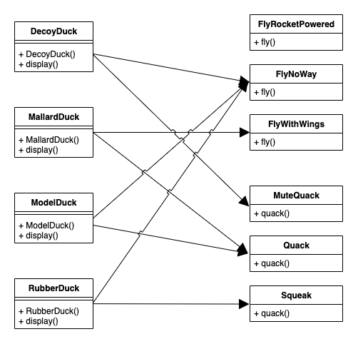
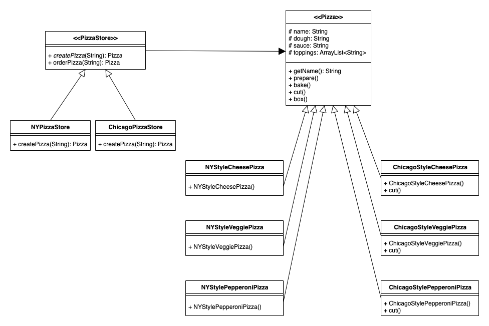
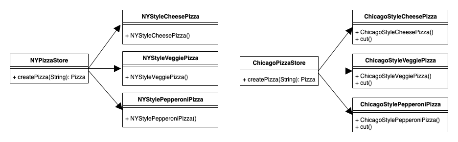
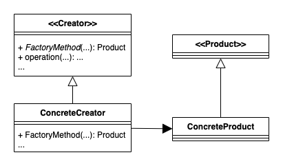
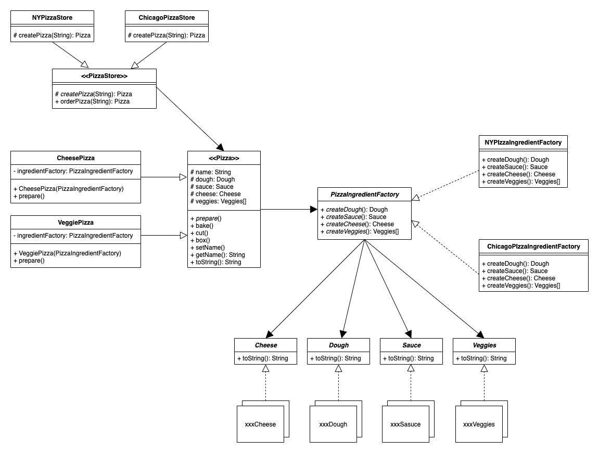
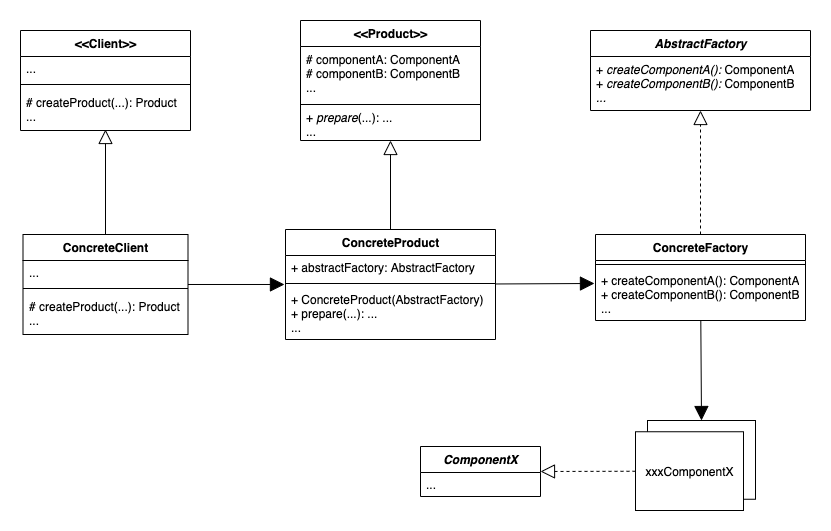

- [Design Principle](#design-principle)
- [Patterns](#patterns)
    - [Strategy](#strategy)
    - [Observer](#observer)
        - [Push Mode](#push-mode)
        - [Pull Mode](#pull-mode)
    - [Decorator](#decorator)
    - [Factory](#factory)
        - [Simple Factory](#simple-factory)
        - [Factory Method](#factory-method)
        - [Abstract Factory](#abstract-factory)
    - [Singleton](#singleton)
    - [Command](#command)
- [Reference](#reference)

This repository is used to have a quick overview on those design patterns introduced from the book __Head First Design Patterns__.

# Design Principle

- Favor composition over inheritance.
- Strive for loosely coupled designs between objects that interact.
- Identify the aspects of your application that vary and separate them from what stays the same.
- Program to an interface, not an implementation.
- Classes should be open for extension, but closed for modification.
- Depend upon abstractions. Do not depend upon concrete classes.

# Patterns

## Strategy

__The Strategy Pattern__ defines a family of algorithms, encapsulates each one, and makes them interchangeable. Strategy lets the algorithm vary independently from clients that use it.

Example Diagram:

How Strategy is actually applied:

## Observer

__The Observer Pattern__ defines a one-to-many dependency between objects so that when one object changes state, all of its dependents are notified and updated automatically.

For simplicity, the connection between `Subject` & `StatisticsDiplay` in _Push_ mode, and connection between `Observable` & `StatisticsDiplay` in _Pull_ mode is not drawn.

### Push Mode

In __Push__ mode, it's `WeatherData` to automatically __push__ notifications to all observers. Whenever there is a change, `WeatherData` would call each observer's `update()` method with its attributes to notify.

Example Diagram:

### Pull Mode

Like the __Push__ mode, `WeatherData` would notify all observers when there is a change under __Pull__ mode. However, unlike data is forcely pushed to observers under __Push__ mode, it's the observer's choice to decide whether to "pull" data from the `Observable` since the `update()` method in __Pull__ mode pass the `Observable` in. That's the key difference between __Pull__ and __Push__.

Note that the code implemented in __Pull__ mode uses existing `Observer` and `Observable` from `java.util` library.

Example Diagram:

## Decorator

__The Decorator Pattern__ attaches additional responsibilities to an object dynamically. Decorators provide a flexible alternative to subclassing for extending functionality.

Example Diagram:

## Factory

__The Factory Method Pattern__ defines an interface for creating an object, but lets subclasses decide which class to instantiate. Factory Method lets a class defer instantiation to subclasses.

__The Abstract Factory Pattern__ provides an interface for creating families of related or dependent objects without specifying their concrete classes.

__Factory Method__ is not the only technique for adhering to the _Dependency Inversion Principle_, but it is one of the more powerful ones. The following guidelines can help you avoid OO designs that violate the _Dependency Inversion Principle_:

- No variable should hold a reference to a concrete class
- No class should derive from a concrete class
- No method should override an implemented method of any of its base classes

### Simple Factory

Defining a simple factory as a static method is a common technique and is often called a static factory. Why use a static method? Because you don’t need to instantiate an object to make use of the create method. But remember it also has the disadvanage that you can’t subclass and change the behavior of the create method.

Set `Pizza` to be abstract is because a pizza must be concrete, such as `CheesePizza`, `VeggiePizza`.

Example Diagram:

### Factory Method

__The Factory Method Pattern__ encapsulates object creation by letting subclasses decide what objects to create.

For __Simple Factory__, there is one factory to `createPizza()`. However, it's concrete `PizzaStore`'s job to `createPizza()` when it comes to __Factor Method__.

Example Diagram:

How Factory Method is actually applied:

The higher level diagram of the __Factory Method__.

### Abstract Factory

Example Diagram:

The higher level diagram of the __Abstract Factory__.

## Singleton

 The __Singleton__ Pattern ensures a class has only one instance, and provides a global point of access to it.

## Command

__The Command Pattern__ encapsulates a request as an object, thereby letting you parameterize other objects with different requests, queue or log requests, and support undoable operations.

Example Diagram:

The mapping of the simple remote control is as below:
- Invoker: `SimpleRemoteControl`
- Command: `Command`
- ConcreteCommand: `LightOnCommand`
- Receiver: `Light`

# Reference
- Online book: https://www.oreilly.com/library/view/head-first-design/0596007124/
- Official source codes: https://wickedlysmart.com/headfirstdesignpatterns/
- Book pdf: http://ce.sharif.edu/courses/98-99/2/ce484-1/resources/root/Design%20Patterns/Eric%20Freeman,%20Elisabeth%20Freeman,%20Kathy%20Sierra,%20Bert%20Bates-Head%20First%20Design%20Patterns%20-OReilly%20(2008).pdf
