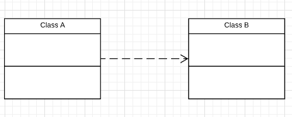
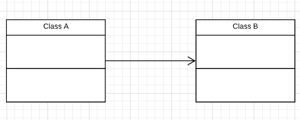
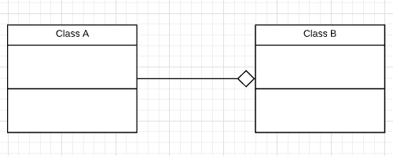
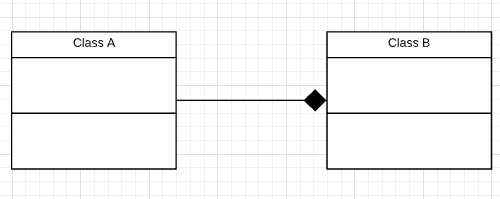
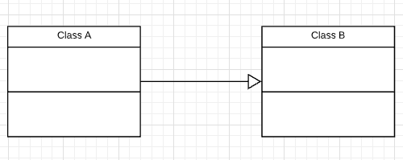
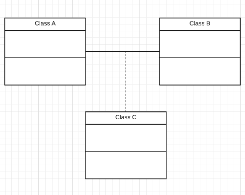

This is the quick recap for UML knowledge.

## Relationship

A is depended on B:

A is associated with B:

A is the aggregation of B:

A is the composition of Bs

A is the generalization of B:

C is association with A and B:

## Reference
- Class Diagrams: https://docs.microsoft.com/en-us/visualstudio/modeling/uml-class-diagrams-reference?view=vs-2015&redirectedfrom=MSDN
- Structural Diagrams: https://dzone.com/refcardz/getting-started-uml?chapter=2
- Lucidchart - Class Diagram Tutorial: https://www.youtube.com/watch?v=UI6lqHOVHic
