This is the quick recap for UML knowledge.

## Attribute
- `-`: private
- `+`: public
- `#`: protected
- `~`: package/default

The name of the abstract class should be included in "<<>>" or in _italics_. The name of the abstract method should also be in _italics_. 

For interface, "<< interface >>" should be shown and the name should be in _italics_ as well.

Any method that is defined only, either abstract method or interface method, should be in _italics_.

## Relationship

Basic relationships:

- Inheritance: 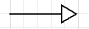
    - a full line with hollow/open arrow
    - the superclass is at the arrow end
    - a class is the generalization of other classes
    - example: Dog - Animal
- Realization: 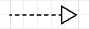
    - a dashed line with hollow/open arrow
    - the interface is at the arrow end
    - a class is the definition of other classes
    - example: Plane - Flyable
- Association: 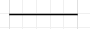
    - a full line without arrow 
    - a full line with a solid or empty arrow is also association
    - a dashed line with an empty arrow is dependency (weaker, transient relationship)
    - a class is associated/depended with other class
    - example: Car - Road
- Aggregation: 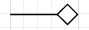
    - a full line with hollow/open diamond
    - the aggregation is at the diamond end
    - a class is a container or collection of other classes
    - example: Employee - Company
- Composition: 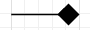
    - a full line with solid/closed diamond
    - the composition is at the diamond end
    - a class is a whole with other classes
    - example: Door - House

Illustrations:

- B is the aggregation of A:
    
    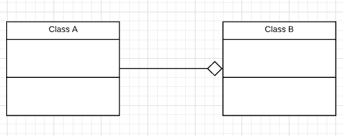

- B is the composition of A:
    
    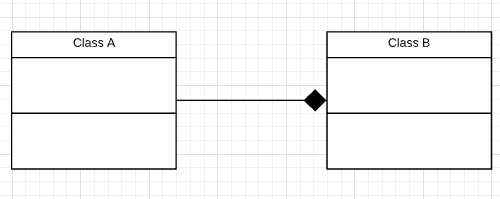

- B is the generalization of A: 
    
    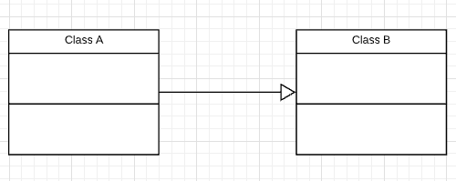

- C is association with A and B:
    
    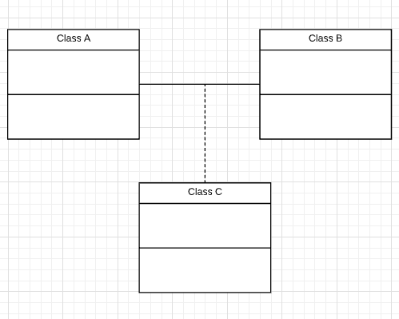

- A is depended on B:

    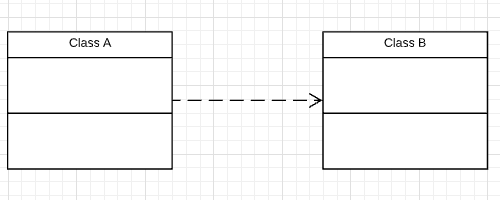

- A is associated with B:

    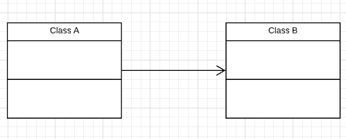

### Multiplicity

- 0..1: zero to one (optional)
- n: specific number
- 0..*: zero to many
- 1..*: one to many
- m..n: specific number range

## Reference
- Lucidchart - Class Diagram Tutorial: https://www.youtube.com/watch?v=UI6lqHOVHic
- UML Class Diagram Relationships Explained with Examples: https://creately.com/blog/diagrams/class-diagram-relationships/
- Class Diagrams: https://docs.microsoft.com/en-us/visualstudio/modeling/uml-class-diagrams-reference?view=vs-2015&redirectedfrom=MSDN
- Structural Diagrams: https://dzone.com/refcardz/getting-started-uml?chapter=2
